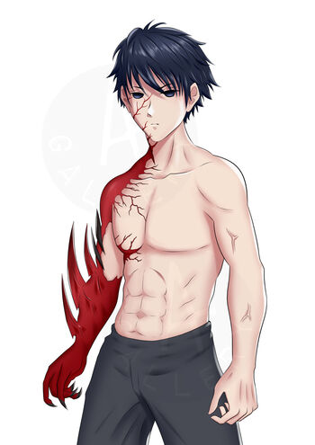
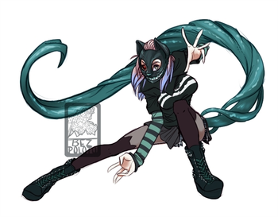

# Carniçal

 

No mundo de Termina, Carniçais são exclusivamente humanos que acabaram sendo afetados pela **Doença de Termina Número 53**. Aqueles que por tal doença são afetados, adquirem uma força incomum, mas em troca seus desejos e vontades são distorcidos, carne se torna seu princípal anseio... Taís ainda são capazes de viver na Zona Viva, mas pessoas que detem uma grande quantidade de mana e poder podem ainda os reconhecer, para eles você pode ou não ser um perigo em potêncial...

 

**Habilidade:** Você ganha uma [Habilidade](../../../src/pages/players/feats.html) de sua escolha e também ganha proficiência com a perícia de Sobrevivência. 
**Tamanho:** Você possui um tamanho *pequeno* ou *Médio*.  
**Pele:** Por causa da doença sua pele se torna branca como a neve.  
**Velocidade:** Sua movimentação padrão é de 25 feet, a infecção...  
**Linguagens:** Você fala comum, uma linguagem extra de sua escolha.  
**Decaimento:** Escolha um membro que possa funcionar como uma mão para ser o seu controle de decaimento.  
**Paladar:** O seu paladar é de um ser exclusivamente carnívoro.  
**Infectado:** Caso você esteja com metade de sua vída máxima você possui desvantagem em qualquer teste de Constituição.

## Como Carniçal você ganha os seguintes benefícios:

 

**Olfato Aguçado:** Como um infectado e um ser faminto por carne, fizeram com que seu interesse e percepção sobre carnes aumentasse. Portanto agora você consegue sentir o cheiro (e origem), de carnes que você já experimentou em uma distância estranhamente absurda (Em mesa, em qualquer área em que o jogador tiver, o DM poderá simplesmente apontar para um local (caso exista) e dizer que você sentiu o cheiro de uma carne que você já provou, detalhes etc.).  

**Mão de Caça:** Como um infectado você aprendeu a utilizar de uma forma favorável sua infecção, mas tal ação possui um preço. Você poderá fazer um sacrifício de sangue (utilizar sua doença, como ação, ação bônus ou reação, com base na descrição da ação), para fazer uma das seguintes coisas (lembrando que cada ação custa 1 token a não ser que se diga o contrário), deixando vísivel seu membro de controle de decaímento:

* **Perfurar** - Como uma ação você pode, *realizar um ataque com sua Mão de Caça a uma criatura em até 5 feet de você, causando ***[1d12 + Modificador de Horror + Bônus de Proficiência]*** de Dano Perfurante.*

* **Golpe Preciso** - Como uma ação você pode, *realizar um ataque extremamente rápido e preciso em uma criatura em até 5 feet de você.*

Portanto, ao declarar a ação *"Golpe Preciso"* você deve escolher uma área específica para acertar na criatura, lembrando que a mesma área não poderá ser afetada duas vezes sequêncialmente *(ex.: não se pode fazer [cabeça, cabeça, perna], se pode fazer [cabeça, perna, cabeça])*:

**1. Cabeça:** Ao escolher essa parte da criatura, ela deve realizar um teste de Força ***[DC 12 + Modificador de Força + Bônus de Proficiência]***. Caso a criatura falhe no teste, ela é atordoada durante seus próximos 2 turnos, em caso de sucesso no teste a criatura só recebe 1d6 de dano Perfurante.  
**2. Peito:** Ao escolher essa parte da criatura, ela terá desvantagem nos seus próximos 4 ataques.  
**3. Braços:** Ao escolher essa parte da criatura, ela é desarmada, onde caso a mesma não possa ser desarmada ela então irá perder sua ação de ataque durante 2 turnos.  
**4. Pernas:** Ao escolher essa parte da criatura, ela deve realizar um teste de Força ***[DC 10 + Modificador de Força + Bônus de Proficiência]***. Caso a criatura falhe no teste, ela é derrubada, em caso de sucesso ela só perde metade do seu movimento durante seus próximos 2 turnos.

* **Agarrar** - Como uma ação ou ação bônus você pode, *lançar sua Mão de Caça em até 20 feet em uma direção de sua escolha, exceto para cima, lhe movendo para lá com imunidade a ataques de oportunidade (após se mover, você volta a receber ataques de oportunidade)*.

* **Arremesar** - Como uma ação você pode, *pegar um objeto e o arremesar em uma criatura que esteja a uma distância de até 30 feet de você, causando ***[1d6 + Modificador de Força]*** de Dano Contundente ou Perfurante (a depender do objeto) e fazendo com que a criatura fique atordoada até o seu próximo turno.*

* **Ódio** - Como uma reação ou ação bônus você pode, *fazer com que sua Mão de Caça se torne uma armadura encouraçada, assim aumentando sua proteção. Você recebe +2 de CA Durante 4 Turnos*.

* **Instinto** - Como uma ação, ação bônus, ação livre ou reação você pode, *se dar vantagem em qualquer teste de Horror*.

* **Berserker** - Como uma reação e 2 fichas você pode, *se entregar a raiva e fúria que um Carniçal decaído possui, lhe concebendo durante 5 turnos resistência a danos físicos do tipo elemental (Gelo, Fogo, Ácido, trovão e relâmpago)*.  

O uso da mão de caça funciona da seguinte forma, por padrão você possui 2 fichas de decaímento/infecção, que podem ser gastas para executar uma das ações acima (Não aumenta) e caso fique sem fichas e deseje utilizar novamente, você precisará fazer uma troca para cada uso acima das 2 fichas padrão, será gasto ***[Metade do Dado de Vida Principal + Bônus de Proficiência]*** de sua vida. Caso o uso passe do limite e você acabe sendo reduzido a 0 pontos de vida, a sua infecção irá controlar seu corpo e assim você irá inevitavelmente morrer (Um descanso longo reseta as 2 fichas).

## Possíveis Aparências de um Carniçal com Sua Mão de Caça Ativada

 

